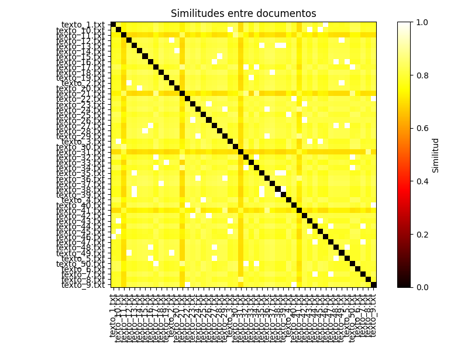

# Detector de Plagio

Este proyecto es una herramienta para detectar similitudes entre documentos de texto utilizando el índice de similitud de Jaccard. La herramienta genera un análisis de similitudes entre pares de documentos y visualiza los resultados en un gráfico de calor.


## ¿Cómo funciona?

### 1. Carga de documentos
El programa carga todos los archivos `.txt` de una carpeta especificada. Cada archivo se considera un documento que será analizado.

```python
docs = load_documents_from_folder(carpeta)
```

### 2. Generación de n-gramas y hashes
Cada documento se divide en fragmentos de texto llamados n-gramas (por defecto, de tamaño 3). Luego, cada n-grama se convierte en un hash único utilizando el algoritmo `blake2b`.

```python
docs_hashed = {nombre: get_hashed_shingles(texto, n=n) for nombre, texto in docs.items()}
```


### 3. Cálculo de similitudes
Se calcula la similitud entre cada par de documentos utilizando el índice de Jaccard. Este índice mide la proporción de elementos comunes entre dos conjuntos (en este caso, los hashes de los n-gramas).

```python
similitudes = comparar_documentos(docs_hashed)
```


### 4. Top de documentos más similares
El programa ordena los pares de documentos por su similitud y muestra los más similares en la consola, con colores que indican el nivel de similitud:

```python
def top_n_similares(similitudes, N=5):
    # Ordena con Merge Sort (usamos sort() que es Timsort ≈ MergeSort en Python)
    similitudes.sort(key=lambda x: x[1], reverse=True)
    return similitudes[:N]
```

- **Rojo**: Similitud mayor al 70%.
- **Amarillo**: Similitud entre el 30% y el 70%.
- **Verde**: Similitud menor al 30%.

```python
for (doc1, doc2), sim in top_n_similares(similitudes, N_top):
    if sim * 100 > 70:
        print(f"{doc1} vs {doc2} → \033[31m{sim * 100:.2f}% similares\033[0m")
    elif sim * 100 > 30:
        print(f"{doc1} vs {doc2} → \033[33m{sim * 100:.2f}% similares\033[0m")
    else:
        print(f"{doc1} vs {doc2} → \033[32m{sim * 100:.2f}% similares\033[0m")
```

### 5. Visualización de resultados
El programa genera un gráfico de calor que muestra las similitudes entre todos los documentos. Cada celda del gráfico representa la similitud entre dos documentos.

```python
graficar_similitudes(similitudes, docs)
```

El gráfico se guarda como un archivo PNG llamado `similitudes.png`.



## Requisitos

- Python 3.7 o superior
- Bibliotecas necesarias:
  - `matplotlib`
  - `numpy`
  - `networkx `
  - `seaborn `

Instala las dependencias con:

```bash
pip install matplotlib numpy
```

## Uso

1. Coloca los documentos `.txt` que deseas analizar en una carpeta (por ejemplo, prueba_media).
2. Configura la variable `carpeta` en el código para apuntar a la carpeta donde están los documentos.
3. Ejecuta el script:

```bash
python main.py
```

## Personalización
- Tamaño de los n-gramas: Cambia el valor de la variable `n` para ajustar el tamaño de los fragmentos de texto analizados.
- Número de resultados mostrados: Cambia el valor de `N_top` para ajustar cuántos pares de documentos más similares se muestran en la consola.